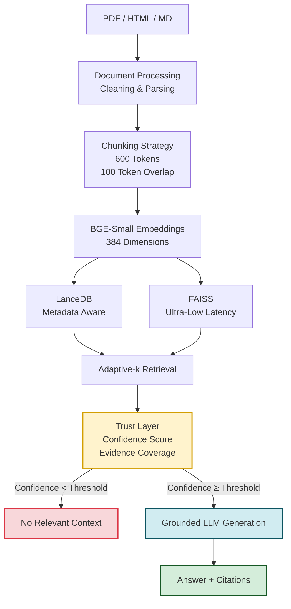

# Cost-Efficient-RAG-Application

> **Production-grade, hallucination-resistant Retrieval-Augmented Generation pipeline with adaptive retrieval, trust scoring, and ultra-low-latency vector search.**


---

# Overview

Large Language Models are powerful, but they suffer from three major production challenges:

- **Hallucinations** when relevant context is unavailable
- **High inference costs** caused by excessive retrieval and token usage
- **Limited observability** into why an answer was generated

**Trust-Aware Cost-Efficient RAG** addresses these problems through a retrieval pipeline that prioritizes **trustworthiness, transparency, latency, and cost efficiency**.

Instead of blindly generating responses, the system evaluates retrieval confidence and evidence coverage before answering. When sufficient evidence is unavailable, it intentionally abstains with:

> *"No relevant context found."*

This design ensures that correctness is prioritized over verbosity.

---

# System Architecture


# Key Engineering Features
**Multi-Vector Backend**: A unified retrieval interface supports multiple vector search engines:

| Backend | Purpose |
|----------|----------|
| **LanceDB** | Metadata-aware retrieval with filtering and citations |
| **FAISS** | Ultra-low-latency approximate nearest neighbor search |

This architecture allows seamless backend switching depending on latency and retrieval requirements.

---

## Trust & Observability Layer

The core innovation of the project.

Before generation, the system computes:

### Confidence Score

Measures retrieval certainty using embedding similarity.

```python
confidence = exp(-distance)
```

### Evidence Coverage

Measures how much retrieved context supports the query.

Only when both metrics exceed configurable thresholds does generation proceed.

Otherwise:

```text
No relevant context found.
```

This actively prevents hallucinations and unsupported answers.

### Citation Heatmap

The dashboard visualizes:

- Retrieved chunks
- Citation frequency
- Confidence levels
- Source attribution

allowing users to inspect why an answer was generated.

---

## Adaptive-k Retrieval

Traditional RAG systems use a fixed:

```python
top_k = 5
```

This project dynamically scales retrieval depth based on query complexity.

### Benefits

- Lower token usage
- Reduced latency
- Better context quality
- Improved cost efficiency

Simple queries retrieve fewer chunks while complex queries automatically retrieve more evidence.

---

## LLM-as-a-Judge Evaluation Framework

A fully automated evaluation harness validates both retrieval and generation quality.

### Retrieval Metrics

Powered by:

```text
ranx
```

Metrics:

- Recall@5
- MRR
- nDCG@5

### Generation Metrics

Evaluated using:

```text
Llama-3 via Groq API
```

Metrics:

- Faithfulness
- Relevance

This allows continuous benchmarking without manual review.

---

## Idempotent Ingestion

Duplicate vectors are prevented using deterministic chunk hashing.

```python
chunk_id = sha256(chunk_text)
```

Benefits:

- No duplicate embeddings
- Safe re-indexing
- Stable vector counts
- Faster ingestion

Re-running ingestion on the same corpus produces identical vector counts.

---

## Interactive Streamlit Dashboard

A production-style observability dashboard displaying:

- Query latency
- Retrieval confidence
- Evidence coverage
- Token usage
- Citation visualization
- Benchmark comparisons
- Backend performance analysis

---

# Benchmark Results

## Retrieval Latency

### FAISS vs LanceDB

| Backend | Avg (ms) | Median (ms) | P95 (ms) |
|----------|----------|-------------|----------|
| LanceDB | 1.9 | 1.9 | 2.0 |
| FAISS | 0.1 | 0.1 | 0.1 |

### Result

> FAISS achieved approximately **23x faster retrieval latency** than embedded LanceDB.

---

## Retrieval Quality

| Metric | Score |
|----------|---------|
| Recall@5 | 1.00 |
| MRR | 1.00 |
| nDCG@5 | 1.00 |

---

## Answer Quality

| Metric | Score |
|----------|---------|
| Faithfulness | 0.99 |
| Relevance | 1.00 |

---

## Cost Efficiency

Adaptive retrieval reduced unnecessary context retrieval while maintaining identical retrieval quality.

| Metric | Fixed-k | Adaptive-k |
|----------|----------|-----------|
| Recall@5 | 1.00 | 1.00 |
| MRR | 1.00 | 1.00 |
| nDCG@5 | 1.00 | 1.00 |
| Avg Latency (ms) | 1235.5 | 21.0 |
| Avg Tokens | Higher | Lower |

### Winner

✅ Adaptive Retrieval

Maintains retrieval quality while reducing latency and token consumption.

---

# Tech Stack

| Layer | Technology |
|---------|-------------|
| API | FastAPI |
| Dashboard | Streamlit |
| Embeddings | BAAI/bge-small-en-v1.5 |
| LLM | Groq (Llama-3) |
| Vector Store | LanceDB |
| ANN Search | FAISS |
| Evaluation | ranx |
| Language | Python 3.10+ |

---

# Installation

## Prerequisites

- Python 3.10+
- Groq API Key

---

## Clone Repository

```bash
git clone https://github.com/yourusername/trust-aware-cost-efficient-rag.git

cd trust-aware-cost-efficient-rag
```

---

## Create Virtual Environment

```bash
python -m venv venv

source venv/bin/activate
```

Windows:

```bash
venv\Scripts\activate
```

---

## Install Dependencies

```bash
pip install -r requirements.txt
```

---

## Environment Variables

Create a `.env` file:

```env
GROQ_API_KEY=your_api_key_here
```

---

# Quick Start

## 1. Build / Rebuild Index

```bash
python -m scripts.rebuild_index
```

---

## 2. Start FastAPI Server

```bash
uvicorn app.main:app --reload
```

API available at:

```text
http://127.0.0.1:8000
```

Swagger Docs:

```text
http://127.0.0.1:8000/docs
```

---

## 3. Launch Dashboard

```bash
streamlit run dashboard.py
```

---

## 4. Run Evaluation

```bash
python -m eval.evaluate
```

---

## 5. Run Latency Benchmark

```bash
python -m eval.benchmark_latency
```

Example output:

```text
FAISS          0.1 ms
LanceDB        1.9 ms

FAISS is 23x faster.
```

---

# Example Query

```bash
curl -X POST http://127.0.0.1:8000/ask \
-H "Content-Type: application/json" \
-d '{
  "question":"What are the main components of the trust layer?"
}'
```

Response:

```json
{
  "answer": "...",
  "confidence": 0.82,
  "evidence_coverage": 0.91,
  "citations": [
    {
      "source": "trust_rag_notes.md",
      "section": "Trust Layer"
    }
  ]
}
```

---

# Project Structure

```text
trust-aware-rag/
│
├── app/
│   ├── main.py
│   ├── retrieval.py
│   ├── trust.py
│   └── generation.py
│
├── data/
│   ├── raw/
│   └── processed/
│
├── dashboard.py
│
├── eval/
│   ├── evaluate.py
│   ├── benchmark_latency.py
│   ├── questions.json
│   └── relevance.json
│
├── scripts/
│   └── rebuild_index.py
│
├── logs/
│
├── requirements.txt
│
└── README.md
```

---

# Future Roadmap

### Infrastructure

- Dockerized deployment
- Kubernetes support
- CI/CD pipelines

### Retrieval

- Hybrid BM25 + Dense Retrieval
- Cross-Encoder Re-ranking
- GraphRAG integration

### Intelligence

- Agentic query routing
- Multi-step reasoning
- Self-reflection and answer verification

### Observability

- OpenTelemetry integration
- Real-time monitoring dashboards
- Cost analytics and forecasting

---

# Why This Project Matters

Most RAG systems optimize only for answer generation.

This project optimizes for:

- **Trust**
- **Latency**
- **Cost**
- **Observability**
- **Production Readiness**

The result is a retrieval system that knows **when to answer, when not to answer, and why**.

---

## Author

**Rahul Manchanda**

B.Tech CSE (AI & ML)  
AI Engineer | Machine Learning | LLM Systems | Retrieval Engineering

Built as an exploration of trustworthy, efficient, and production-ready Retrieval-Augmented Generation systems.
